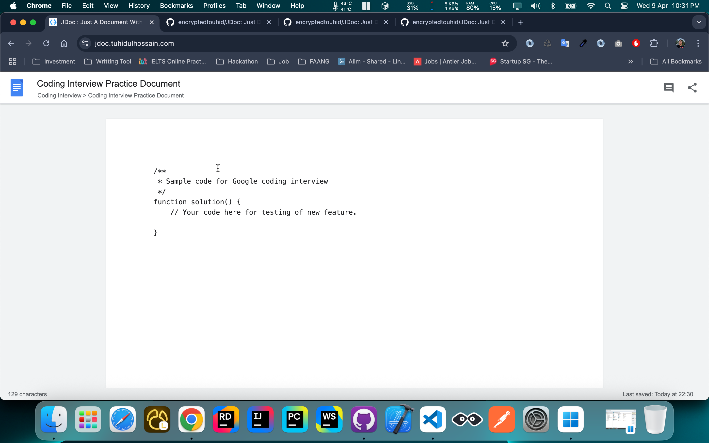

# JDoc - Code Document Editor

JDoc is a simple document editor with code highlighting, built with Vue 3 and Vite.

## Features

- Code editor with syntax highlighting
- Google Docs-inspired UI
- Character count tracking
- Support for JavaScript, Python, Java, and C++ highlighting

## DEMO




## Project Setup

```bash
# Clone the repository
git clone https://github.com/encryptedtouhid/JDoc.git

# Install dependencies
npm install

# Start development server
npm run dev

# Build for production
npm run build

# Preview production build
npm run preview
```

## Customization

You can customize the application by:

1. Adding more language support in `main.js`
2. Modifying the styling in `style.css`
3. Adding more features to the editor components

## Technologies Used

- Vue 3 (Composition API with `<script setup>`)
- Vite
- highlight.js for syntax highlighting

## License

MIT